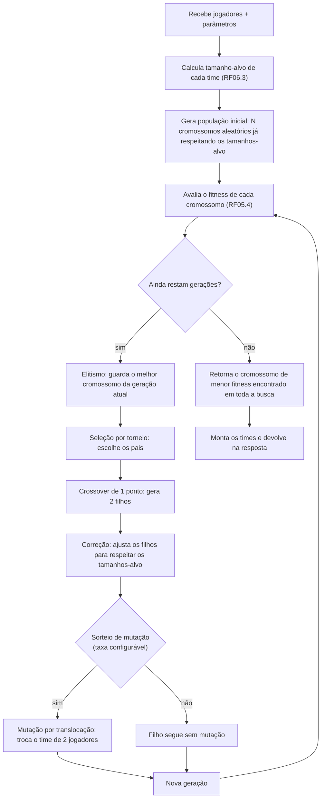
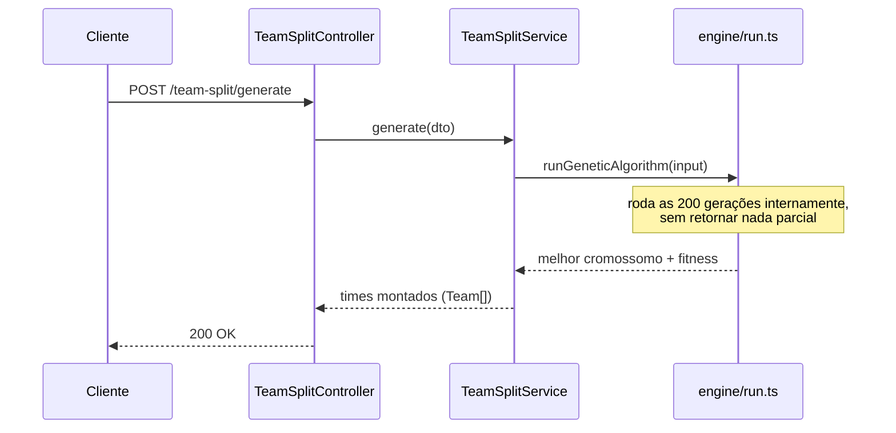

# Divisão de times via Algoritmo Genético (RF05, RF06)

- Status: aprovado
- Data: 2026-08-02
- Implementado em: `apps/api/src/team-split/` (branch `feat/RF05-divisao-times-algoritmo-genetico`)

## Contexto

O RF05/RF06 pedem um algoritmo genético para dividir os jogadores presentes de um racha em
K times equilibrados, considerando média, gols e assistências. O módulo foi implementado de
forma isolada — recebe os jogadores e os parâmetros diretamente no corpo da requisição, sem
depender de `Racha`/`Player` persistidos no banco (RF02–RF04 ainda não existem no schema do
Prisma). Isso permite testar e evoluir o algoritmo sem acoplar a outras partes do sistema
ainda não construídas.

## Visão geral do módulo

```
apps/api/src/team-split/
  team-split.module.ts         // registra controller + service
  team-split.controller.ts     // POST /team-split/generate
  team-split.service.ts        // orquestra: monta o input, chama o motor, monta a resposta
  dto/generate-team-split.dto.ts
  engine/
    team-sizes.ts    // RF06.3: tamanho-alvo de cada time
    chromosome.ts     // representação do cromossomo + população inicial
    fitness.ts         // função de fitness (RF05.4)
    operators.ts        // seleção, crossover + correção, mutação
    run.ts        // loop principal do AG
```

Os contratos de entrada/saída (`generateTeamSplitSchema`, `teamSplitParamsSchema`,
`teamSplitResultSchema` etc.) vivem em `packages/shared/src/schemas/team-split.schema.ts`,
compartilhados entre `api`/`web`/`app`.

## Como o algoritmo funciona

### Representação do problema

Cada jogador presente vira uma posição de um vetor (o "cromossomo"). O valor guardado em
cada posição é o índice do time para o qual aquele jogador foi alocado:

| Posição (jogador) | 0 | 1 | 2 | 3 | 4 | 5 |
|---|---|---|---|---|---|---|
| Time alocado | 0 | 1 | 0 | 1 | 0 | 1 |

Nesse exemplo (6 jogadores, 2 times), os jogadores das posições 0, 2 e 4 formam o Time 0; os
das posições 1, 3 e 5 formam o Time 1.

### Fluxo do algoritmo



Com os parâmetros padrão (`populationSize: 50`, `generations: 200`), isso significa até
10.000 combinações avaliadas — tudo isso acontece **dentro de uma única requisição HTTP**,
de forma síncrona; o cliente só recebe o resultado depois de todo o processo terminar (nunca
o "chute" inicial nem resultados intermediários):



### Função de fitness

Fitness de **minimização** — quanto menor, mais equilibrados os times. Para cada atributo
(`average`, `goals`, `assists`), soma-se a diferença entre as médias de todos os pares de
times, ponderada pelo peso configurado e normalizada pela amplitude do atributo entre os
jogadores de entrada (necessário porque `average` vai de 0 a 5 enquanto `goals`/`assists` não
têm limite superior — sem normalizar, esses dois atributos dominariam a fitness só por terem
escala maior):

```
para cada atributo a em {average, goals, assists}:
  range_a = max(jogador.a) - min(jogador.a) entre os jogadores presentes
  para cada time t: média_a(t) = média do atributo a entre os jogadores do time t
  desequilíbrio_a = Σ (para cada par de times) |média_a(t1) - média_a(t2)| / range_a

fitness = Σ_a peso_a × desequilíbrio_a
```

Ver [`engine/fitness.ts`](../../apps/api/src/team-split/engine/fitness.ts).

## Canônico ou variante?

**É uma variante**, não o algoritmo genético canônico (aquele com string binária, seleção por
roleta e mutação bit a bit):

| Elemento | Canônico (SGA clássico) | Implementado aqui |
|---|---|---|
| Codificação | string binária | vetor de inteiros (posição = jogador, valor = time) |
| Seleção | roleta | torneio |
| Crossover | 1 ponto, sem mais nada | 1 ponto + **correção pós-crossover** |
| Mutação | inverte um bit | troca (swap) o time de 2 jogadores — mutação por translocação |
| Sobrevivência | população inteira substituída | com **elitismo** (melhor indivíduo sempre passa) |

A correção pós-crossover é a peça mais importante dessa diferença: como cada time precisa
terminar com um tamanho exato (RF06.3), um crossover comum pode gerar um filho inválido (time
com jogador a mais ou a menos); essa etapa resolve isso.

Importante: apesar de resolver um problema de particionamento em grupos, **não é** uma
implementação do *Grouping Genetic Algorithm* (GGA, Falkenauer 1994) — o GGA usa uma
codificação de cromossomo por grupos (não por item) com crossover especializado que troca
grupos inteiros entre pais. O que foi implementado usa a codificação direta (item→grupo) mais
simples, mais um operador de reparo — abordagem também usada na referência estrutural
principal (ver abaixo). O termo tecnicamente correto é **"algoritmo genético adaptado para
problema de particionamento, com codificação direta e reparo"**.

## Referências utilizadas

Baseado em um acervo de 6 fontes acadêmicas sobre AG aplicado à formação de equipes de
futebol (fora do repositório). Das usadas efetivamente:

- **"Formação de Equipes Homogêneas com o Uso de Algoritmo Genético"** (Souza et al., Revista
  Ciências Exatas, 2023) — referência estrutural principal: formato do cromossomo, fitness por
  diferença de atributos, crossover de 1 ponto + correção, mutação por translocação. É o único
  dos artigos consultados que resolve o mesmo problema (particionar todos os presentes em
  times), em vez de selecionar os melhores de um grupo maior.
- **Material didático de Algoritmos Genéticos** (Prof. Ricardo Kerschbaumer, IFC) — apoio
  teórico pontual: terminologia, elitismo, seleção por torneio, critérios de parada.

Uma terceira fonte (dissertação de mestrado sobre o método MEM-GA, IFF 2018) foi avaliada e
**descartada como base estrutural** — resolve um problema de seleção (escolher os N melhores
de um pool maior, cromossomo binário), não de partição, o que não corresponde ao RF05/RF06.

## Escopo e limitações conhecidas

- **Sem autenticação no endpoint.** RF05.1 diz que é o administrador do racha quem inicia a
  divisão, mas como o módulo não está ligado a Racha/Player ainda, não há guard de auth aqui —
  isso precisa ser adicionado quando o módulo for integrado ao restante do sistema.
- **Sem persistência (RF04).** O resultado não é salvo em histórico; a resposta é o único
  registro da divisão gerada.
- **Não determinístico.** Por padrão usa `Math.random()`; a mesma lista de jogadores gera
  times diferentes a cada execução, ainda que com nível de equilíbrio (fitness) semelhante,
  já que múltiplas divisões diferentes costumam atingir o mesmo patamar de equilíbrio.
